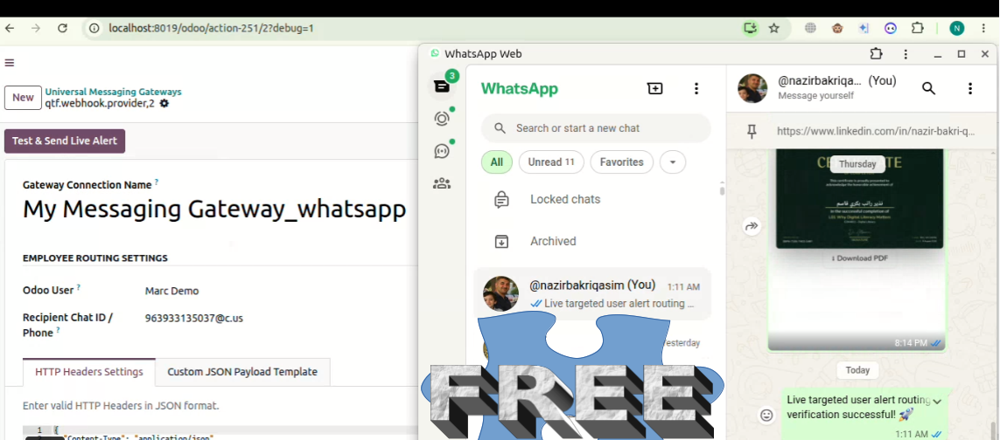
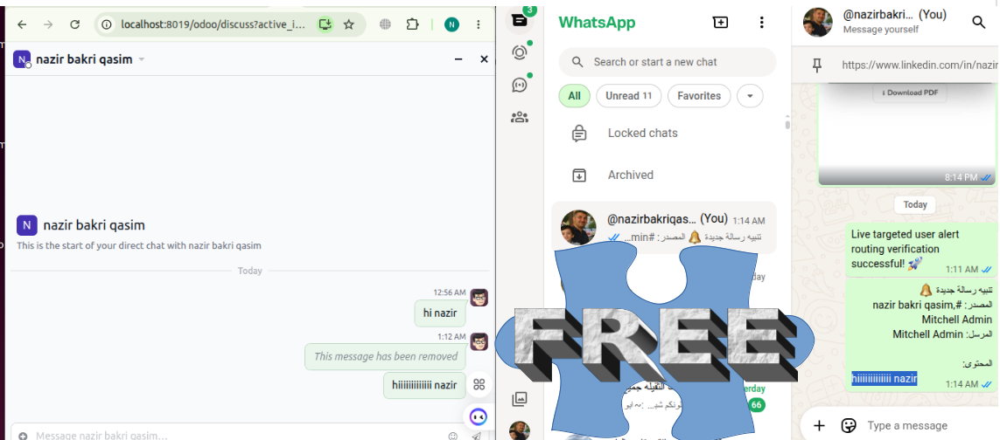
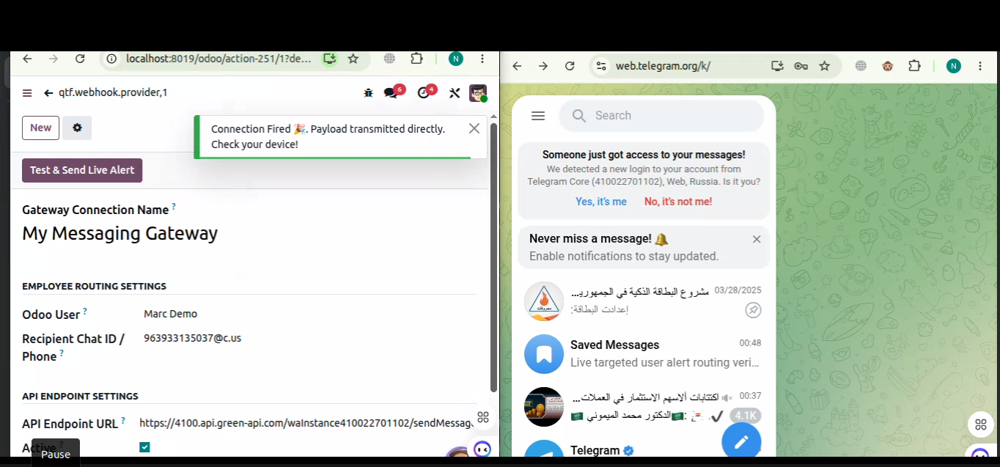
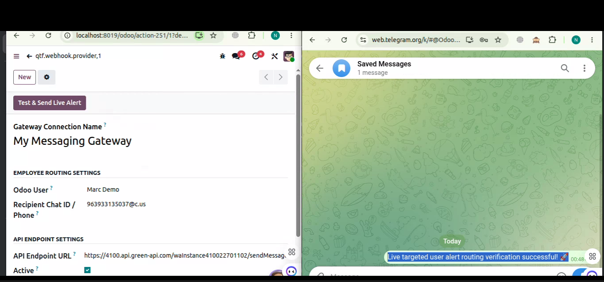
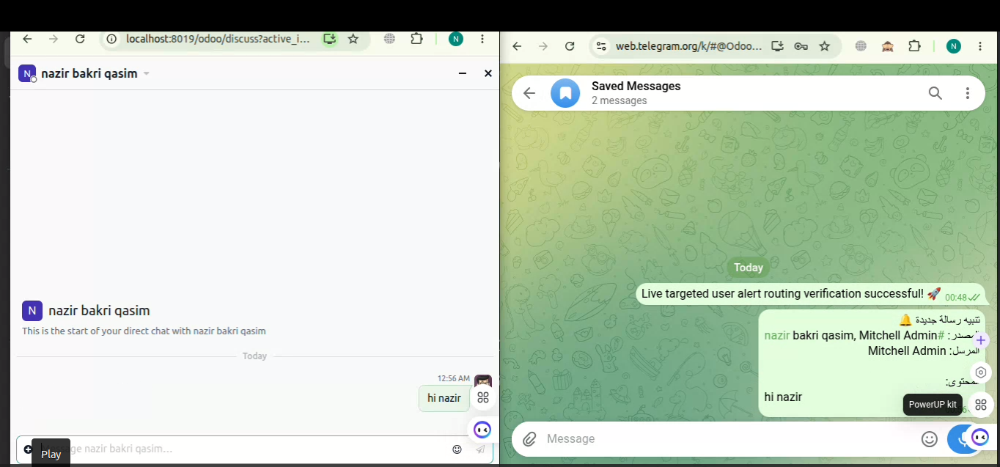

===========================================
QTF Omni Webhook & Messenger Connector
===========================================

-----------------------------------------------------------------------------------
Never Miss a Critical Update: Instant Odoo Notifications to Your Pocket!
-----------------------------------------------------------------------------------

**QTF Omni Webhook & Messenger Connector** is a powerful, lightweight, and completely free open-source module designed for Odoo 19. It acts as an instant bridge, intercepting internal messages from Odoo Discuss channels and forwards them dynamically to any external API or chat gateway (such as WhatsApp via Green API/Twilio, Telegram Bots, Signal, or Custom Webhooks).

Why Managers & Business Owners Love This?
===========================================

Managers cannot stay logged into Odoo 24/7, leading to missed urgent chats, delayed decisions, and communication bottlenecks. With this engine, **urgent announcements and critical alerts are instantly pushed to WhatsApp or Telegram**. Whether it is an emergency broadcast, a high-priority approval, or a time-sensitive client update, managers receive it on their phones within milliseconds, ensuring seamless business continuity even when offline.

Key Features
============

Universal Compatibility
-----------------------
Works natively with any HTTP POST API gateway worldwide.

Docker & Localhost Ready
------------------------
Bypasses internal Odoo sandboxing limits securely via native server requests.

Custom Headers & Payloads
-------------------------
Fully customizable JSON template fields using the ``{{message}}`` placeholder.

Clean Text Stripping
---------------------
Automatically strips complex HTML/P/BR tags from chat strings before dispatching.

WhatsApp Integration Screenshots
================================

WhatsApp Configuration Layout
-----------------------------

Message Delivery to WhatsApp Client
-----------------------------------

Telegram Integration Screenshots
================================

Telegram Configuration Layout
-----------------------------

Test Message
------------

Message Delivery to Telegram Client
-----------------------------------

Quick Setup Guide
=================

1. **Install the Module:** Activate the app in your Odoo 19 instance.
2. **Configure Webhook:** Go to the newly created Webhook menu and click *Create*.
3. **Set API Endpoint:** Paste your destination URL (e.g., Green API, Twilio, or Telegram Bot API).
4. **Select Channels:** Choose which Odoo Discuss channels you want to monitor and forward.
5. **Select Target Users:** Specify the exact users whose chat messages you want to track and broadcast.
6. **Test Connection:** Send a test message in the channel and verify the payload in your chat client.

Supporting Free & Open-Source Tools
===================================

★ ★ ★ ★ ★

Your support keeps this project alive and open-source! If this module successfully saved your development time or helped your business, please leave us a **5-star rating** on the Odoo Apps Store. Your feedback means the world to us!

Developed & Maintained by
=========================

Nazir Bakri Qasim
